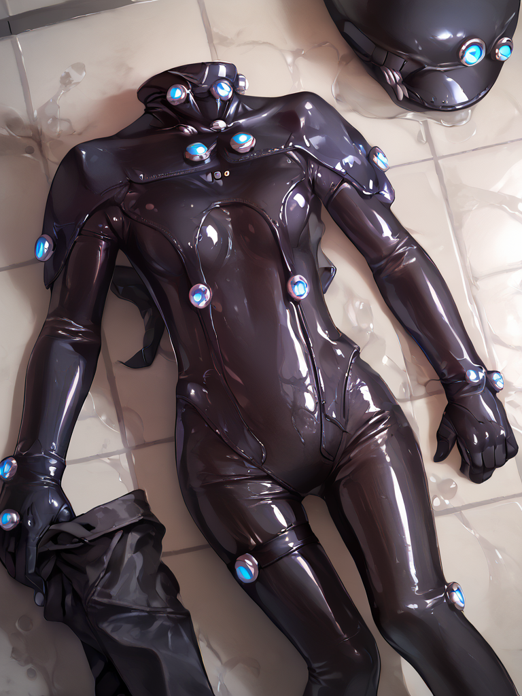

score_9, score_8_up, score_7_up, zPDXL, zPDXLpg,
rindou,
<lora:Rindou:1.0>,
lemon0012, glowing, bodysuit, latex, gloves, koyama \(gantz0409jp\), shiny clothes, black bodysuit,
 <lora:lemon0012-Gantz Lightening_pony_v1:1>,
clothes removed, no humans, bathroom, on floor
 <lora:clothes_removed_v1.1:1>
Negative prompt: score_6, score_5, score_4,
zPDXL-neg, zPDXLpg-neg, simple background
Steps: 30, CFG scale: 7, Sampler: DPM++ 2M, Seed: 2338901715, Size: 768x1024, Model: autismmixSDXL_autismmixPony, Version: v1.9.4, TI hashes: [object Object], Model hash: 821aa5537f, Schedule type: Karras, ADetailer model: face_yolov8n.pt, ADetailer version: 24.5.1, ADetailer mask blur: 4, ADetailer confidence: 0.3, ADetailer dilate erode: 4, ADetailer inpaint padding: 32, ADetailer denoising strength: 0.4, ADetailer inpaint only masked: True, Clip skip: 2