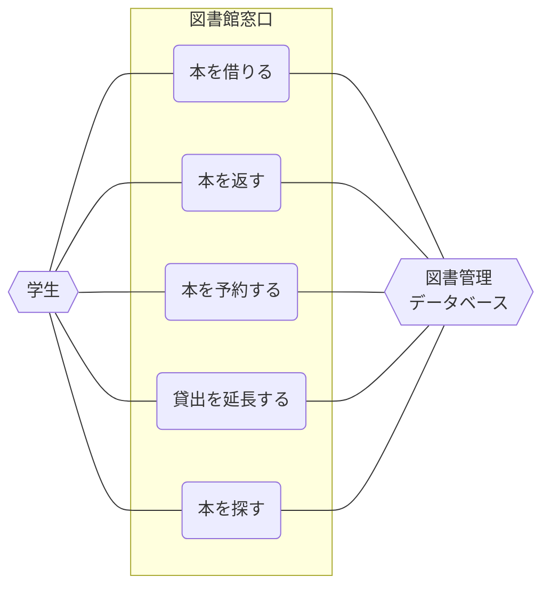

```mermaid
flowchart LR
s{{学生}}
k{{図書管理
データベース}}

s --- t1(本を借りる) --- k
s --- t2(本を返す) --- k
s --- t3(本を予約する) --- k
s --- t4(貸出を延長する) --- k
s --- t5(本を探す) --- k

subgraph 図書館窓口
t1
t2
t3
t4
t5
end
```