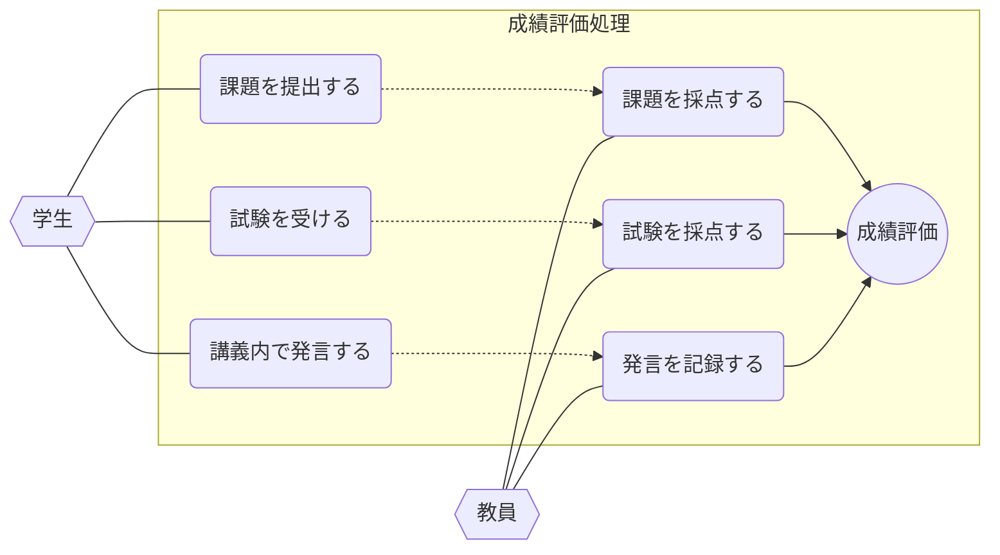

```mermaid
flowchart LR
  s{{学生}}
  t{{教員}}

  %% 学生のユースケース
  s --- u1(課題を提出する)
  s --- u2(試験を受ける)
  s --- u3(講義内で発言する)

  %%必ず実行される処理
  u1 -..-> u4 --> k
  u2 -..-> u5 --> k
  u3 -..-> u6 --> k

  %% 教員のユースケース
  t --- u4(課題を採点する)
  t --- u5(試験を採点する)
  t --- u6(発言を記録する)

  %% 結果
  k((成績評価))

  %% グループ
  subgraph 成績評価処理
    u1
    u2
    u3
    u4
    u5
    u6
    k
  end
```