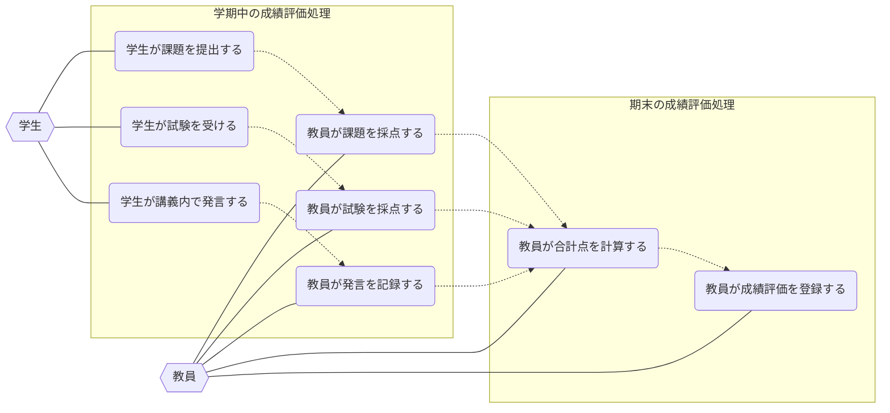

```mermaid
flowchart LR
%% === アクター定義 ===
s{{学生}}
t{{教員}}

%% === 学期中の処理 ===
subgraph 学期中の成績評価処理
  u1(学生が課題を提出する)
  u2(学生が試験を受ける)
  u3(学生が講義内で発言する)
  u4(教員が課題を採点する)
  u5(教員が試験を採点する)
  u6(教員が発言を記録する)

  %% include関係：各行為が発生したとき必ず教員が対応処理を行う
  u1 -.-> u4
  u2 -.-> u5
  u3 -.-> u6
end

%% === 期末の処理 ===
subgraph 期末の成績評価処理
  u7(教員が合計点を計算する)
  u8(教員が成績評価を登録する)
end

%% === アクターとユースケースの関連 ===
s --- u1
s --- u2
s --- u3

t --- u4
t --- u5
t --- u6
t --- u7
t --- u8

%% 依存関係：期末処理は学期中の評価結果に依存
u4 -.-> u7
u5 -.-> u7
u6 -.-> u7
u7 -.-> u8
```