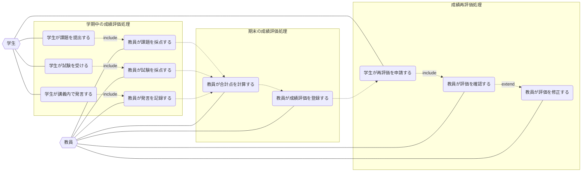

```mermaid
flowchart LR
%% === アクター定義 ===
s{{学生}}
t{{教員}}

%% === 学期中の処理 ===
subgraph 学期中の成績評価処理
  u1(学生が課題を提出する)
  u2(学生が試験を受ける)
  u3(学生が講義内で発言する)
  u4(教員が課題を採点する)
  u5(教員が試験を採点する)
  u6(教員が発言を記録する)

  %% include関係（必ず実行される）
  u1 -. include .-> u4
  u2 -. include .-> u5
  u3 -. include .-> u6
end

%% === 期末の処理 ===
subgraph 期末の成績評価処理
  u7(教員が合計点を計算する)
  u8(教員が成績評価を登録する)

  %% 依存関係
  u4 -.-> u7
  u5 -.-> u7
  u6 -.-> u7
  u7 -.-> u8
end

%% === 再評価の処理 ===
subgraph 成績再評価処理
  u9(学生が再評価を申請する)
  u10(教員が評価を確認する)
  u11(教員が評価を修正する)

  %% include / extend 関係
  u9 -. include .-> u10
  u10 -. extend .-> u11
end

%% === アクターとユースケースの関連 ===
s --- u1
s --- u2
s --- u3
s --- u9

t --- u4
t --- u5
t --- u6
t --- u7
t --- u8
t --- u10
t --- u11

%% 依存関係（再評価は登録済み評価に依存）
u8 -.-> u9

```