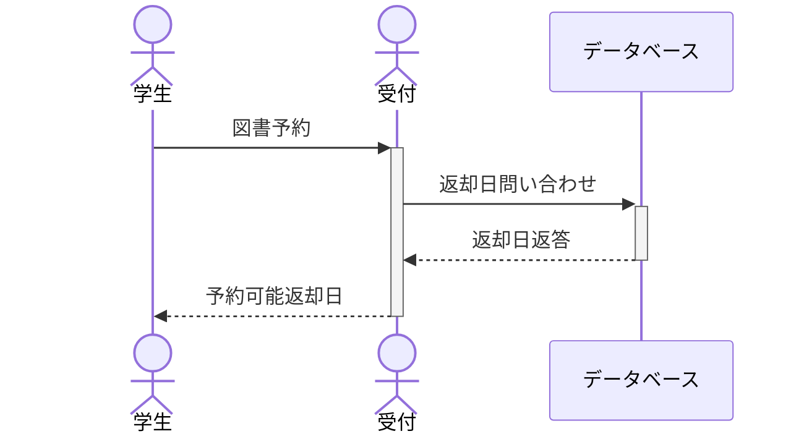

```mermaid
sequenceDiagram
%% シーケンス図、時間的制約はないが時制は存在する。
actor s as 学生
actor r as 受付
participant db as データベース
s ->>+ r : 図書予約
%% アクティブ化[+,-]稼働中かどうかを表す。
 r ->>+db : 返却日問い合わせ
 db-->>- r: 返却日返答
r -->>- s : 予約可能返却日


```