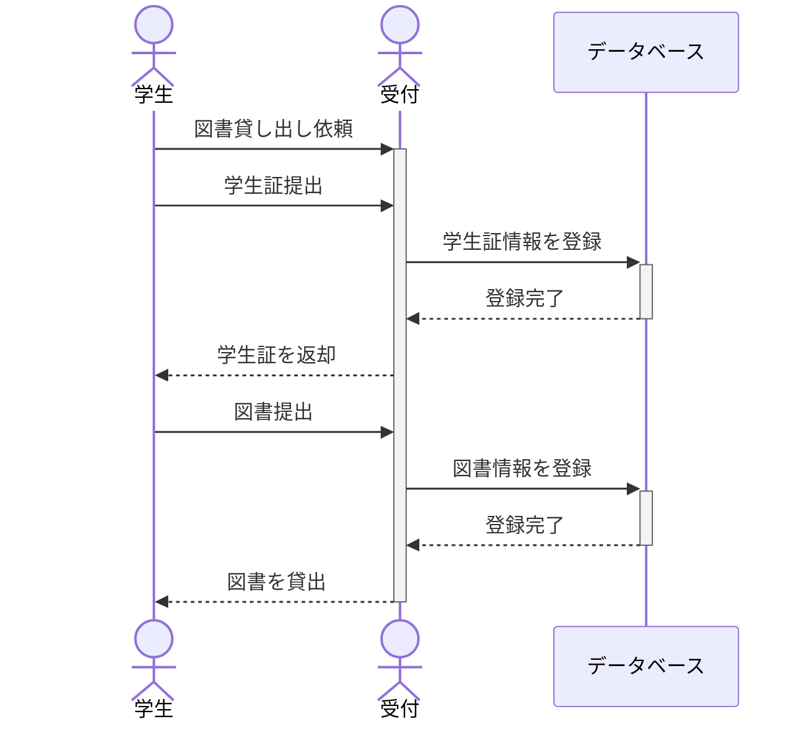

```mermaid
sequenceDiagram
%% 図書貸出処理のシーケンス図
actor s as 学生
actor r as 受付
participant db as データベース

s ->>+ r : 図書貸し出し依頼
s ->> r : 学生証提出
r ->>+ db : 学生証情報を登録
db -->>- r : 登録完了
r -->> s : 学生証を返却

s ->> r : 図書提出
r ->>+ db : 図書情報を登録
db -->>- r : 登録完了
r -->>- s : 図書を貸出

```