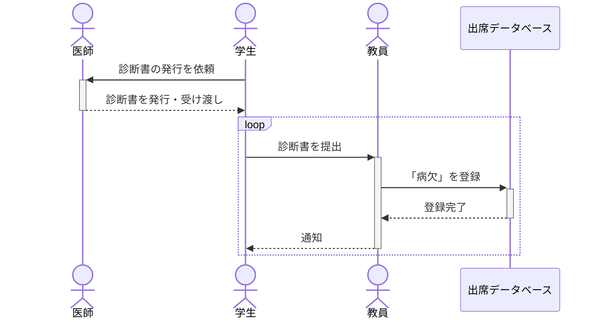

```mermaid
sequenceDiagram
%% 病欠届提出のシーケンス図
actor d as 医師
actor s as 学生

actor t as 教員
participant db as 出席データベース

s ->>+ d : 診断書の発行を依頼
d -->>- s : 診断書を発行・受け渡し
loop
    s ->>+ t : 診断書を提出
    t ->>+ db : 「病欠」を登録
    db -->>- t : 登録完了
    t -->>- s :　通知
end

```