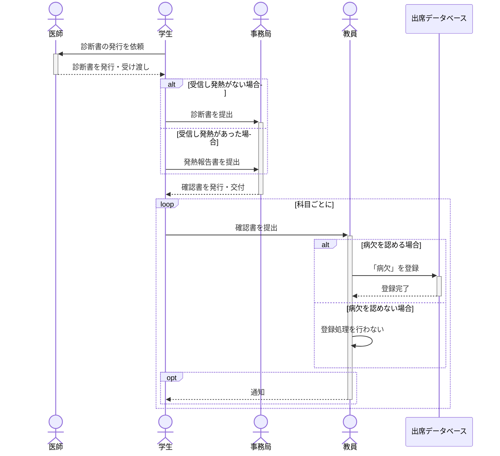

```mermaid
sequenceDiagram
%% 病欠届提出のシーケンス図
actor d as 医師
actor s as 学生
actor o as 事務局
actor t as 教員

participant db as 出席データベース

    s ->>+ d : 診断書の発行を依頼
    d -->>- s : 診断書を発行・受け渡し
alt 受信し発熱がない場合
    s ->>+ o : 診断書を提出
else 受信し発熱があった場合
    s ->> o : 発熱報告書を提出
end
o -->>- s : 確認書を発行・交付
loop 科目ごとに
    s ->>+ t : 確認書を提出
    alt 病欠を認める場合
        t ->>+ db : 「病欠」を登録
        db -->>- t : 登録完了
    else 病欠を認めない場合
        t ->> t : 登録処理を行わない
    end
    opt
        t -->>- s : 通知
    end
end
```