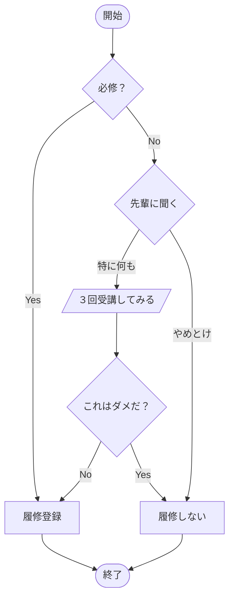

```mermaid
flowchart TD
A([開始])
hisshu{"必修？"}
rishu["履修登録"]
senpai{"先輩に聞く"}
pass["履修しない"]
loop[/"３回受講してみる"/]
dameda{"これはダメだ？"}
Z([終了])
    A --> hisshu
    hisshu -->|Yes| rishu
    hisshu -->|No| senpai
    dameda -->|Yes| pass
    senpai -->|"やめとけ"| pass
    senpai -->|"特に何も"| loop
    loop --> dameda
    dameda -->|No| rishu
    rishu --> Z
    pass --> Z
```