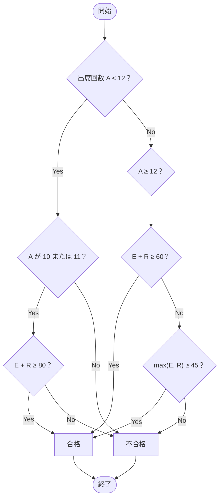

```mermaid
flowchart TD
    A([開始])

    chkA{"出席回数 A < 12？"}
    chkA_10_11{"A が 10 または 11？"}
    chk80{"E + R ≥ 80？"}

    chkA_over{"A ≥ 12？"}
    chk60{"E + R ≥ 60？"}
    max45{"max(E, R) ≥ 45？"}

    pass["合格"]
    fail["不合格"]
    Z([終了])

    A --> chkA

    %% 出席 < 12 の場合
    chkA -->|Yes| chkA_10_11
    chkA -->|No| chkA_over

    chkA_10_11 -->|Yes| chk80
    chkA_10_11 -->|No| fail

    chk80 -->|Yes| pass
    chk80 -->|No| fail

    %% 出席 >=12 の場合
    chkA_over --> chk60
    chk60 -->|Yes| pass
    chk60 -->|No| max45
    max45 -->|Yes| pass
    max45 -->|No| fail

    pass --> Z
    fail --> Z


```