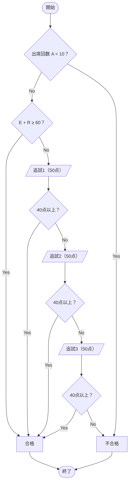

```mermaid
flowchart TD
    A([開始])
    chkA{"出席回数 A < 10？"}
    sum60{"E + R ≥ 60？"}
    exam1[/"追試1（50点）"/]
    chk40_1{"40点以上？"}
    exam2[/"追試2（50点）"/]
    chk40_2{"40点以上？"}
    exam3[/"追試3（50点）"/]
    chk40_3{"40点以上？"}
    pass["合格"]
    fail["不合格"]
    Z([終了])

    A --> chkA
    chkA -->|No| sum60
chkA -->|Yes| fail
    sum60 -->|Yes| pass
    sum60 -->|No| exam1

    exam1 --> chk40_1
    chk40_1 -->|Yes| pass
    chk40_1 -->|No| exam2

    exam2 --> chk40_2
    chk40_2 -->|Yes| pass
    chk40_2 -->|No| exam3

    exam3 --> chk40_3
    chk40_3 -->|Yes| pass
    chk40_3 -->|No| fail

    pass --> Z
    fail --> Z
```