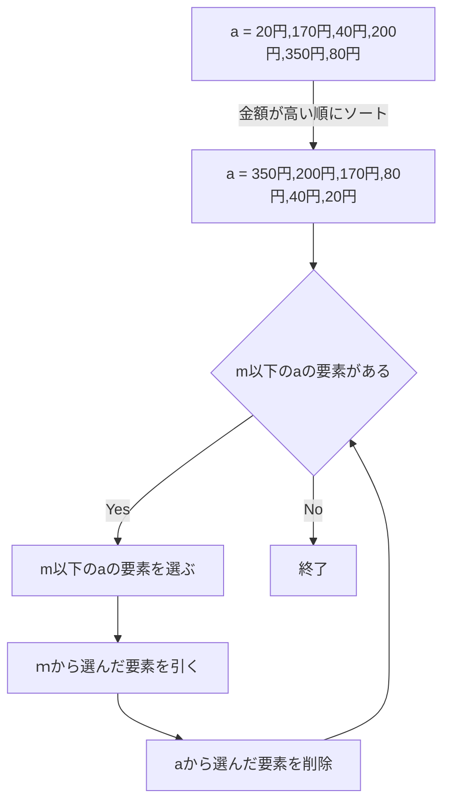

```mermaid
flowchart TD
    A["a = 20円,170円,40円,200円,350円,80円"]
    AS["a = 350円,200円,170円,80円,40円,20円"]
    choose{"m以下のaの要素がある"}
    maxPick["m以下のaの要素を選ぶ"]
    addBag["ｍから選んだ要素を引く"]
    up["aから選んだ要素を削除"]
    Z[終了]

    choose -->|No| Z
    A-->|金額が高い順にソート|　AS
    AS --> choose
    maxPick --> addBag
    addBag --> up
    up --> choose
    choose -->|Yes| maxPick
```