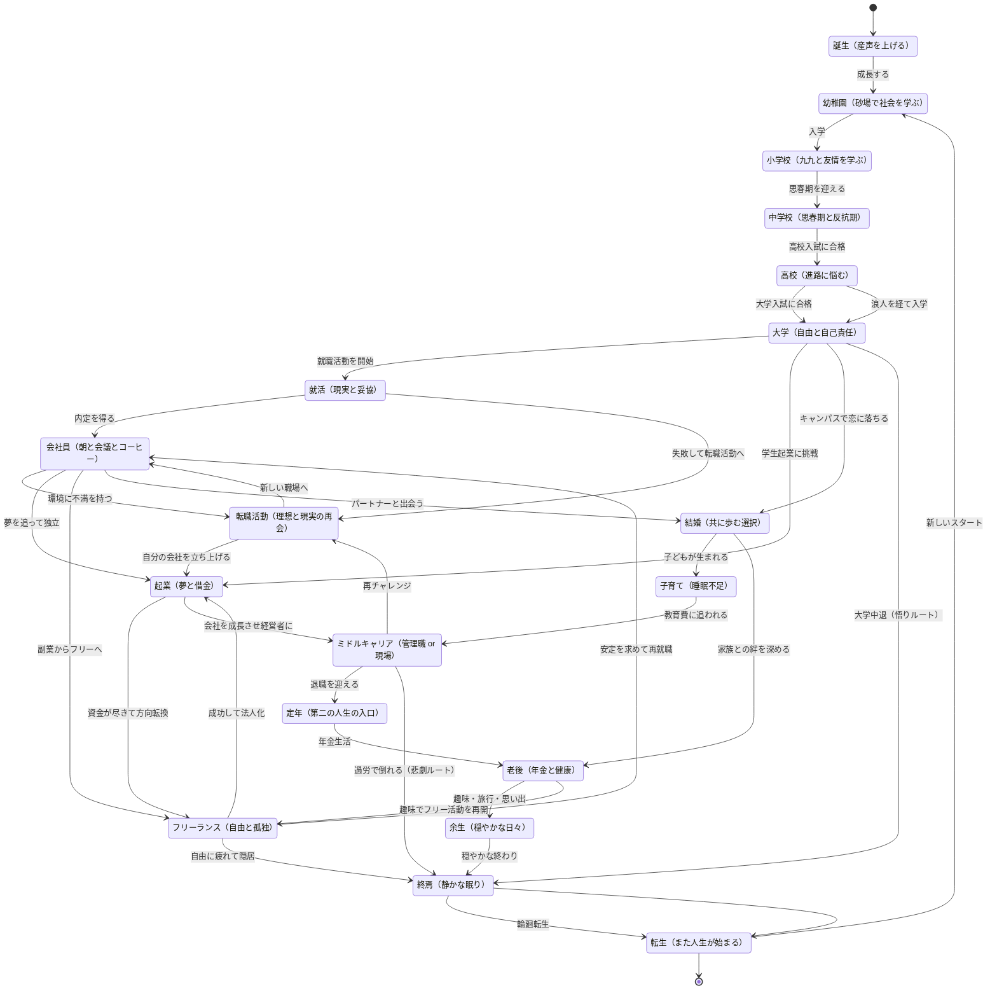

```mermaid
stateDiagram-v2
  direction TB

  %% --- 基本ステージ ---
  s0 : 誕生（産声を上げる）
  s1 : 幼稚園（砂場で社会を学ぶ）
  s2 : 小学校（九九と友情を学ぶ）
  s3 : 中学校（思春期と反抗期）
  s4 : 高校（進路に悩む）
  s5 : 大学（自由と自己責任）
  s6 : 就活（現実と妥協）
  s7 : 会社員（朝と会議とコーヒー）
  s8 : 転職活動（理想と現実の再会）
  s9 : 起業（夢と借金）
  s10 : フリーランス（自由と孤独）
  s11 : 結婚（共に歩む選択）
  s12 : 子育て（睡眠不足）
  s13 : ミドルキャリア（管理職 or 現場）
  s14 : 定年（第二の人生の入口）
  s15 : 老後（年金と健康）
  s16 : 余生（穏やかな日々）
  s17 : 終焉（静かな眠り）
  s18 : 転生（また人生が始まる）

  %% --- 開始・終了 ---
  [*] --> s0
  s17 --> s18 : 輪廻転生
  s18 --> s1 : 新しいスタート

  %% --- 教育段階 ---
  s0 --> s1 : 成長する
  s1 --> s2 : 入学
  s2 --> s3 : 思春期を迎える
  s3 --> s4 : 高校入試に合格
  s4 --> s5 : 大学入試に合格
  s5 --> s6 : 就職活動を開始

  %% --- 就職フェーズ ---
  s6 --> s7 : 内定を得る
  s6 --> s8 : 失敗して転職活動へ
  s7 --> s8 : 環境に不満を持つ
  s8 --> s7 : 新しい職場へ
  s7 --> s9 : 夢を追って独立
  s7 --> s10 : 副業からフリーへ
  s9 --> s10 : 資金が尽きて方向転換
  s10 --> s7 : 安定を求めて再就職

  %% --- プライベートフェーズ ---
  s7 --> s11 : パートナーと出会う
  s11 --> s12 : 子どもが生まれる
  s12 --> s13 : 教育費に追われる
  s13 --> s14 : 退職を迎える
  s14 --> s15 : 年金生活
  s15 --> s16 : 趣味・旅行・思い出
  s16 --> s17 : 穏やかな終わり

  %% --- 番外ルート（蛇足） ---
  s5 --> s9 : 学生起業に挑戦
  s5 --> s11 : キャンパスで恋に落ちる
  s4 --> s5 : 浪人を経て入学
  s8 --> s9 : 自分の会社を立ち上げる
  s10 --> s9 : 成功して法人化
  s9 --> s13 : 会社を成長させ経営者に
  s11 --> s15 : 家族との絆を深める
  s15 --> s10 : 趣味でフリー活動を再開
  s13 --> s8 : 再チャレンジ
  s13 --> s17 : 過労で倒れる（悲劇ルート）
  s5 --> s17 : 大学中退（悟りルート）
  s10 --> s17 : 自由に疲れて隠居

  %% --- 永遠ループ ---
  s17 --> s18
  s18 --> [*]

```