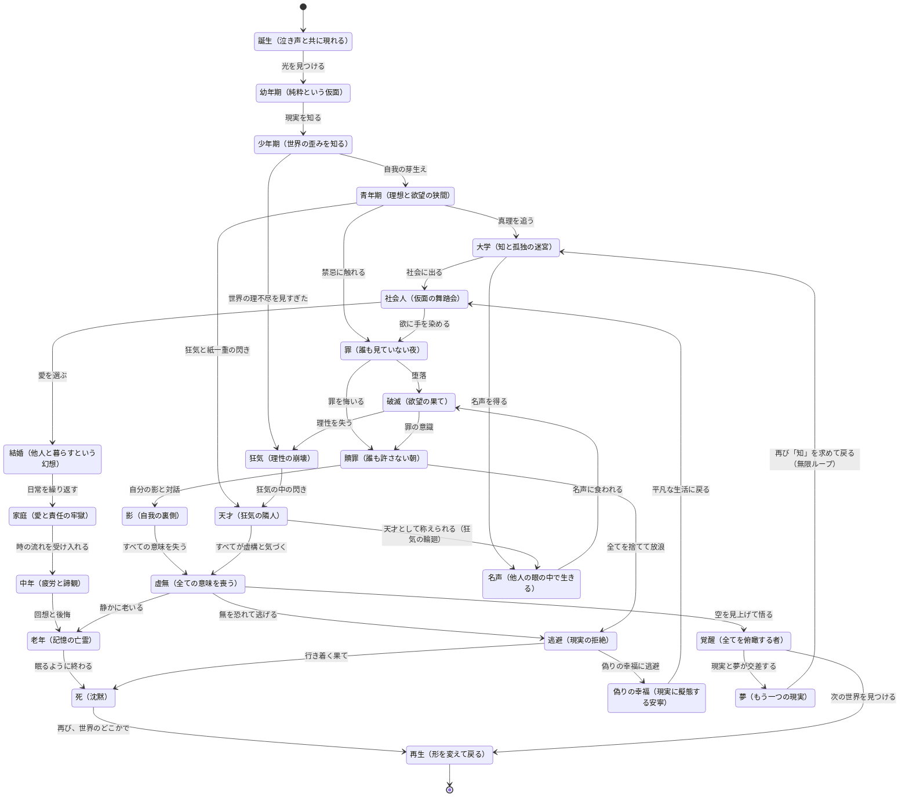

```mermaid
stateDiagram-v2
direction TB

%% --- 原初 ---
s0 : 誕生（泣き声と共に現れる）
s1 : 幼年期（純粋という仮面）
s2 : 少年期（世界の歪みを知る）
s3 : 青年期（理想と欲望の狭間）
s4 : 大学（知と孤独の迷宮）
s5 : 社会人（仮面の舞踏会）
s6 : 結婚（他人と暮らすという幻想）
s7 : 家庭（愛と責任の牢獄）
s8 : 中年（疲労と諦観）
s9 : 老年（記憶の亡霊）
s10 : 死（沈黙）
s11 : 再生（形を変えて戻る）

%% --- 分岐する裏ルート ---
s12 : 狂気（理性の崩壊）
s13 : 天才（狂気の隣人）
s14 : 虚無（全ての意味を喪う）
s15 : 名声（他人の眼の中で生きる）
s16 : 破滅（欲望の果て）
s17 : 逃避（現実の拒絶）
s18 : 覚醒（全てを俯瞰する者）
s19 : 偽りの幸福（現実に擬態する安寧）
s20 : 夢（もう一つの現実）
s21 : 罪（誰も見ていない夜）
s22 : 贖罪（誰も許さない朝）
s23 : 影（自我の裏側）

[*] --> s0
s0 --> s1 : 光を見つける
s1 --> s2 : 現実を知る
s2 --> s3 : 自我の芽生え
s3 --> s4 : 真理を追う
s4 --> s5 : 社会に出る
s5 --> s6 : 愛を選ぶ
s6 --> s7 : 日常を繰り返す
s7 --> s8 : 時の流れを受け入れる
s8 --> s9 : 回想と後悔
s9 --> s10 : 眠るように終わる
s10 --> s11 : 再び、世界のどこかで

%% --- 江戸川乱歩的・迷宮分岐 ---
s2 --> s12 : 世界の理不尽を見すぎた
s3 --> s13 : 狂気と紙一重の閃き
s3 --> s21 : 禁忌に触れる
s21 --> s22 : 罪を悔いる
s22 --> s23 : 自分の影と対話
s23 --> s14 : すべての意味を失う
s14 --> s17 : 無を恐れて逃げる
s17 --> s19 : 偽りの幸福に逃避
s19 --> s5 : 平凡な生活に戻る
s14 --> s18 : 空を見上げて悟る
s18 --> s20 : 現実と夢が交差する
s20 --> s4 : 再び「知」を求めて戻る（無限ループ）

%% --- 栄光と破滅ルート ---
s4 --> s15 : 名声を得る
s15 --> s16 : 名声に食われる
s16 --> s12 : 理性を失う
s12 --> s13 : 狂気の中の閃き
s13 --> s15 : 天才として称えられる（狂気の輪廻）
s13 --> s14 : すべてが虚構と気づく
s14 --> s9 : 静かに老いる

%% --- 裏社会ルート ---
s5 --> s21 : 欲に手を染める
s21 --> s16 : 堕落
s16 --> s22 : 罪の意識
s22 --> s17 : 全てを捨てて放浪
s17 --> s10 : 行き着く果て

%% --- メタ的存在ルート ---
s18 --> s11 : 次の世界を見つける
s11 --> [*]


```