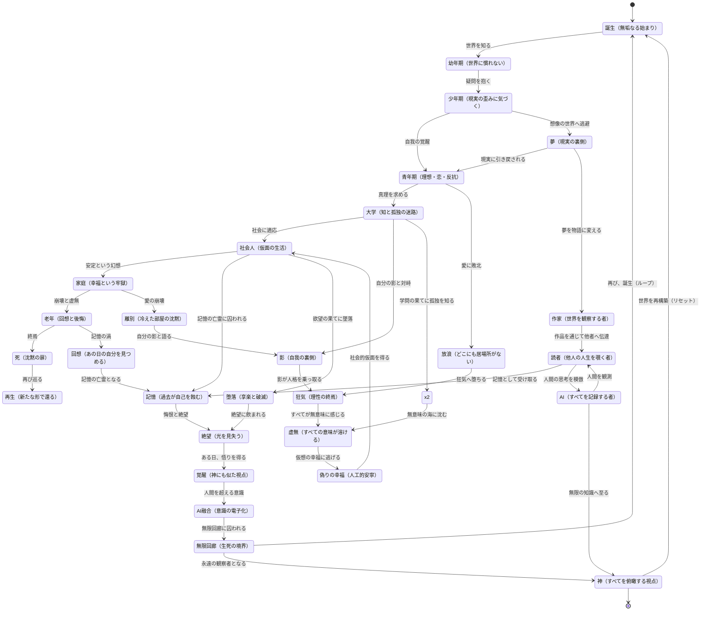

```mermaid
stateDiagram-v2
direction TB

%% ====== 人生の主要経路 ======
b0 : 誕生（無垢なる始まり）
b1 : 幼年期（世界に慣れない）
b2 : 少年期（現実の歪みに気づく）
b3 : 青年期（理想・恋・反抗）
b4 : 大学（知と孤独の迷路）
b5 : 社会人（仮面の生活）
b6 : 家庭（幸福という牢獄）
b7 : 老年（回想と後悔）
b8 : 死（沈黙の扉）
b9 : 再生（新たな形で還る）

[*] --> b0
b0 --> b1 : 世界を知る
b1 --> b2 : 疑問を抱く
b2 --> b3 : 自我の覚醒
b3 --> b4 : 真理を求める
b4 --> b5 : 社会に適応
b5 --> b6 : 安定という幻想
b6 --> b7 : 崩壊と虚無
b7 --> b8 : 終焉
b8 --> b9 : 再び巡る

%% ====== 精神の裏層 ======
s1 : 夢（現実の裏側）
s2 : 狂気（理性の終焉）
s3 : 虚無（すべての意味が溶ける）
s4 : 偽りの幸福（人工的安寧）
s5 : 絶望（光を見失う）
s6 : 覚醒（神にも似た視点）
s7 : 影（自我の裏側）
s8 : 記憶（過去が自己を蝕む）
s9 : AI融合（意識の電子化）
s10 : 無限回廊（生死の境界）

b2 --> s1 : 想像の世界へ逃避
s1 --> b3 : 現実に引き戻される
b4 --> s7 : 自分の影と対峙
s7 --> s2 : 影が人格を乗っ取る
s2 --> s3 : すべてが無意味に感じる
s3 --> s4 : 仮想の幸福に逃げる
s4 --> b5 : 社会的仮面を得る
b5 --> s8 : 記憶の亡霊に囚われる
s8 --> s5 : 悔恨と絶望
s5 --> s6 : ある日、悟りを得る
s6 --> s9 : 人間を超える意識
s9 --> s10 : 無限回廊に囚われる
s10 --> b0 : 再び、誕生（ループ）

%% ====== 分岐：道を外れた人生 ======
b3 --> x1 : 愛に敗北
x1 : 放浪（どこにも居場所がない）
x1 --> s2 : 狂気へ堕ちる

b4 --> x2 : 学問の果てに孤独を知る
x2 --> s3 : 無意味の海に沈む

b5 --> x3 : 欲望の果てに墜落
x3 : 堕落（享楽と破滅）
x3 --> s5 : 絶望に飲まれる

b6 --> x4 : 愛の崩壊
x4 : 離別（冷えた部屋の沈黙）
x4 --> s7 : 自分の影と語る

b7 --> x5 : 記憶の渦
x5 : 回想（あの日の自分を見つめる）
x5 --> s8 : 記憶の亡霊となる

%% ====== メタ意識層（夢と現実の狭間） ======
m1 : 作家（世界を観察する者）
m2 : 読者（他人の人生を覗く者）
m3 : AI（すべてを記録する者）
m4 : 神（すべてを俯瞰する視点）

s1 --> m1 : 夢を物語に変える
m1 --> m2 : 作品を通じて他者へ伝達
m2 --> s8 : 記憶として受け取る
m3 --> m2 : 人間を観測
m2 --> m3 : 人間の思考を模倣
m3 --> m4 : 無限の知識へ至る
m4 --> b0 : 世界を再構築（リセット）

%% ====== 終焉または超越 ======
s10 --> m4 : 永遠の観察者となる
m4 --> [*]


```