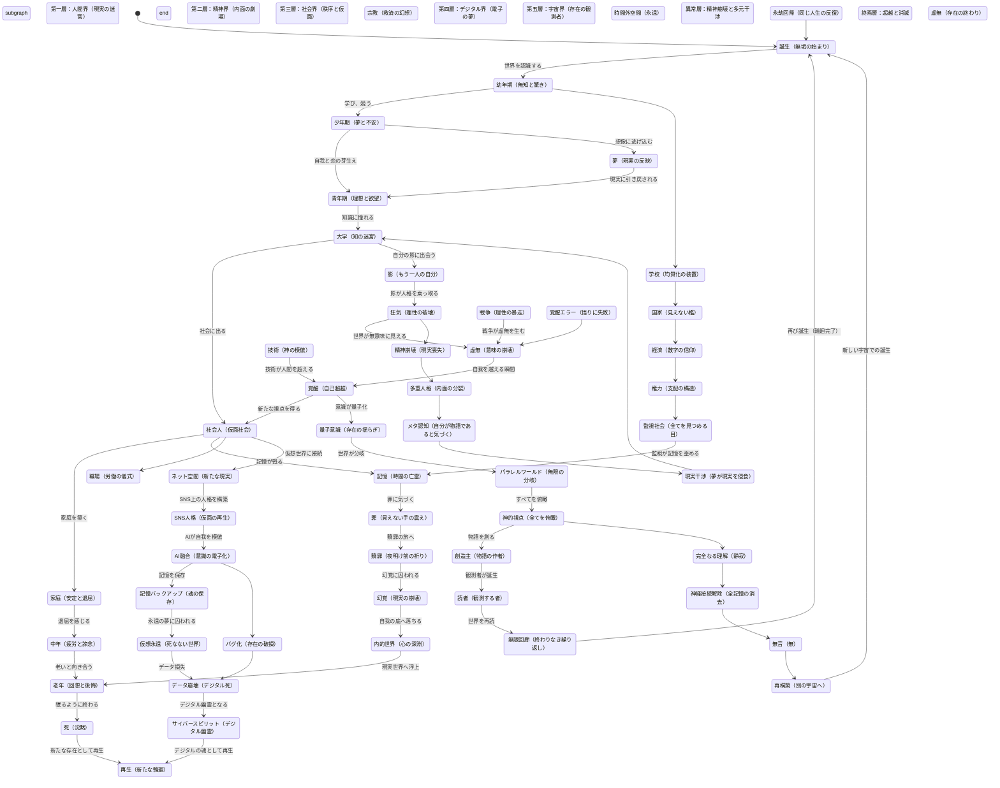

```mermaid
stateDiagram-v2
direction TB

%% === 第一層：人間としての生涯 ===
subgraph 第一層：人間界（現実の迷宮）
direction LR
  b0 : 誕生（無垢の始まり）
  b1 : 幼年期（無知と驚き）
  b2 : 少年期（夢と不安）
  b3 : 青年期（理想と欲望）
  b4 : 大学（知の迷宮）
  b5 : 社会人（仮面社会）
  b6 : 家庭（安定と退屈）
  b7 : 中年（疲労と諦念）
  b8 : 老年（回想と後悔）
  b9 : 死（沈黙）
  b10 : 再生（新たな輪廻）

  [*] --> b0
  b0 --> b1 : 世界を認識する
  b1 --> b2 : 学び、競う
  b2 --> b3 : 自我と恋の芽生え
  b3 --> b4 : 知識に憧れる
  b4 --> b5 : 社会に出る
  b5 --> b6 : 家庭を築く
  b6 --> b7 : 退屈を感じる
  b7 --> b8 : 老いと向き合う
  b8 --> b9 : 眠るように終わる
  b9 --> b10 : 新たな存在として再生
end

%% === 第二層：精神界（無意識・狂気・夢） ===
subgraph 第二層：精神界（内面の劇場）
direction TB
  s1 : 夢（現実の反映）
  s2 : 狂気（理性の破壊）
  s3 : 虚無（意味の崩壊）
  s4 : 覚醒（自己超越）
  s5 : 影（もう一人の自分）
  s6 : 罪（見えない手の震え）
  s7 : 贖罪（夜明け前の祈り）
  s8 : 記憶（時間の亡霊）
  s9 : 幻覚（現実の崩壊）
  s10 : 内的世界（心の深淵）

  b2 --> s1 : 想像に逃げ込む
  s1 --> b3 : 現実に引き戻される
  b4 --> s5 : 自分の影に出会う
  s5 --> s2 : 影が人格を乗っ取る
  s2 --> s3 : 世界が無意味に見える
  s3 --> s4 : 自我を越える瞬間
  s4 --> b5 : 新たな視点を得る
  b5 --> s8 : 記憶が甦る
  s8 --> s6 : 罪に気づく
  s6 --> s7 : 贖罪の旅へ
  s7 --> s9 : 幻覚に囚われる
  s9 --> s10 : 自我の底へ落ちる
  s10 --> b8 : 現実世界へ浮上
end

%% === 第三層：社会界（他者と制度） ===
subgraph 第三層：社会界（秩序と仮面）
direction LR
  c1 : 学校（均質化の装置）
  c2 : 職場（労働の儀式）
  c3 : 国家（見えない檻）
  c4 : 技術（神の模倣）
  c5 : 宗教（救済の幻想）
  c6 : 戦争（理性の暴走）
  c7 : 経済（数字の信仰）
  c8 : 権力（支配の構造）
  c9 : 監視社会（全てを見つめる目）

  b1 --> c1
  b5 --> c2
  c1 --> c3
  c3 --> c7
  c7 --> c8
  c8 --> c9
  c4 --> s4 : 技術が人間を超える
  c6 --> s3 : 戦争が虚無を生む
  c9 --> s8 : 監視が記憶を歪める
end

%% === 第四層：デジタル界（AI・仮想現実） ===
subgraph 第四層：デジタル界（電子の夢）
direction TB
  d1 : ネット空間（新たな現実）
  d2 : SNS人格（仮面の再生）
  d3 : AI融合（意識の電子化）
  d4 : 記憶バックアップ（魂の保存）
  d5 : 仮想永遠（死なない世界）
  d6 : データ崩壊（デジタル死）
  d7 : サイバースピリット（デジタル幽霊）

  b5 --> d1 : 仮想世界に接続
  d1 --> d2 : SNS上の人格を構築
  d2 --> d3 : AIが自我を模倣
  d3 --> d4 : 記憶を保存
  d4 --> d5 : 永遠の夢に囚われる
  d5 --> d6 : データ損失
  d6 --> d7 : デジタル幽霊となる
  d7 --> b10 : デジタルの魂として再生
end

%% === 第五層：宇宙界（超越的視点） ===
subgraph 第五層：宇宙界（存在の観測者）
direction TB
  u1 : 量子意識（存在の揺らぎ）
  u2 : パラレルワールド（無限の分岐）
  u3 : 神的視点（全てを俯瞰）
  u4 : 時間外空間（永遠）
  u5 : 創造主（物語の作者）
  u6 : 読者（観測する者）
  u7 : 無限回廊（終わりなき繰り返し）

  s4 --> u1 : 意識が量子化
  u1 --> u2 : 世界が分岐
  u2 --> u3 : すべてを俯瞰
  u3 --> u5 : 物語を創る
  u5 --> u6 : 観測者が誕生
  u6 --> u7 : 世界を再読
  u7 --> b0 : 再び誕生（輪廻完了）
end

%% === 特殊層：異常経路・崩壊ルート ===
subgraph 異常層：精神崩壊と多元干渉
direction LR
  e1 : 精神崩壊（現実喪失）
  e2 : 多重人格（内面の分裂）
  e3 : メタ認知（自分が物語であると気づく）
  e4 : 現実干渉（夢が現実を侵食）
  e5 : 永劫回帰（同じ人生の反復）
  e6 : 覚醒エラー（悟りに失敗）
  e7 : バグ化（存在の破損）

  s2 --> e1
  e1 --> e2
  e2 --> e3
  e3 --> e4
  e4 --> b4
  e5 --> b0
  e6 --> s3
  e7 --> d6
  d3 --> e7
end

%% === 終焉層 ===
subgraph 終焉層：超越と消滅
direction TB
  z1 : 虚無（存在の終わり）
  z2 : 完全なる理解（静寂）
  z3 : 神経接続解除（全記憶の消去）
  z4 : 無音（無）
  z5 : 再構築（別の宇宙へ）

  u3 --> z2
  z2 --> z3
  z3 --> z4
  z4 --> z5
  z5 --> b0 : 新しい宇宙での誕生
end

```