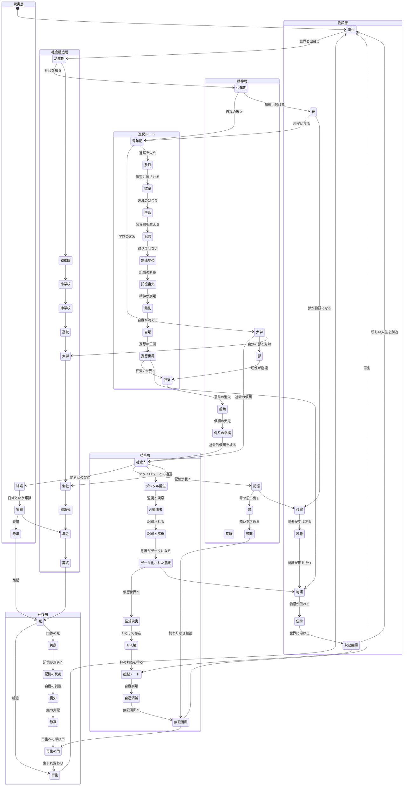

```mermaid
stateDiagram-v2
direction TB

%%===========================
%% 🌱 現実層（社会的な人生）
%%===========================
state "現実層" as Real {
    direction TB
    r0 : 誕生
    r1 : 幼年期
    r2 : 少年期
    r3 : 青年期
    r4 : 大学
    r5 : 社会人
    r6 : 結婚
    r7 : 家庭
    r8 : 老年
    r9 : 死
    r10 : 再生

    [*] --> r0
    r0 --> r1 : 世界と出会う
    r1 --> r2 : 社会を知る
    r2 --> r3 : 自我の確立
    r3 --> r4 : 学びの迷宮
    r4 --> r5 : 社会の仮面
    r5 --> r6 : 他者との契約
    r6 --> r7 : 日常という牢獄
    r7 --> r8 : 衰退
    r8 --> r9 : 最期
    r9 --> r10 : 輪廻
    r10 --> r0
}

%%===========================
%% 🧠 精神層（内面世界）
%%===========================
state "精神層" as Mind {
    direction TB
    m0 : 夢
    m1 : 狂気
    m2 : 虚無
    m3 : 影
    m4 : 覚醒
    m5 : 偽りの幸福
    m6 : 罪
    m7 : 贖罪
    m8 : 記憶
    m9 : 無限回廊

    r2 --> m0 : 想像に逃げる
    m0 --> r3 : 現実に戻る
    r4 --> m3 : 自分の影と対峙
    m3 --> m1 : 理性が崩壊
    m1 --> m2 : 意味の消失
    m2 --> m5 : 仮初の安定
    m5 --> r5 : 社会的仮面を被る
    r5 --> m8 : 記憶が蠢く
    m8 --> m6 : 罪を思い出す
    m6 --> m7 : 贖いを求める
    m7 --> m9 : 終わりなき輪廻
    m9 --> r0 : 再生
}

%%===========================
%% 🏢 社会構造層（外界）
%%===========================
state "社会構造層" as Society {
    direction TB
    s0 : 幼稚園
    s1 : 小学校
    s2 : 中学校
    s3 : 高校
    s4 : 大学
    s5 : 会社
    s6 : 結婚式
    s7 : 年金
    s8 : 葬式

    r1 --> s0
    s0 --> s1
    s1 --> s2
    s2 --> s3
    s3 --> s4
    s4 --> s5
    s5 --> s6
    s6 --> s7
    s7 --> s8
    s8 --> r9
}

%%===========================
%% 📚 物語層（メタ意識）
%%===========================
state "物語層" as Meta {
    direction TB
    t0 : 作家
    t1 : 読者
    t2 : 物語
    t3 : 伝承
    t4 : 永劫回帰

    m0 --> t0 : 夢が物語になる
    t0 --> t1 : 読者が受け取る
    t1 --> t2 : 認識が形を持つ
    t2 --> t3 : 物語が伝わる
    t3 --> t4 : 世界に溶ける
    t4 --> r0 : 新しい人生を創造
}

%%===========================
%% 🤖 技術層（AI・デジタル）
%%===========================
state "技術層" as AI {
    direction TB
    a0 : デジタル誕生
    a1 : AI観測者
    a2 : 記録と解析
    a3 : データ化された意識
    a4 : 仮想現実
    a5 : AI人格
    a6 : 超越ノード
    a7 : 自己消滅

    r5 --> a0 : テクノロジーとの遭遇
    a0 --> a1 : 監視と観察
    a1 --> a2 : 記録される
    a2 --> a3 : 意識がデータになる
    a3 --> a4 : 仮想世界へ
    a4 --> a5 : AIとして存在
    a5 --> a6 : 神の視点を得る
    a6 --> a7 : 自我崩壊
    a7 --> m9 : 無限回廊へ
}

%%===========================
%% ☠️ 死後層（冥界・霊的）
%%===========================
state "死後層" as After {
    direction TB
    d0 : 黄泉
    d1 : 記憶の反芻
    d2 : 喪失
    d3 : 静寂
    d4 : 再生の門

    r9 --> d0 : 肉体の死
    d0 --> d1 : 記憶が渦巻く
    d1 --> d2 : 自我の剥離
    d2 --> d3 : 無の支配
    d3 --> d4 : 再生への呼び声
    d4 --> r10 : 生まれ変わり
}

%%===========================
%% 🕸️ 分岐・逸脱・迷路
%%===========================
state "逸脱ルート" as Chaos {
    direction TB
    c0 : 放浪
    c1 : 欲望
    c2 : 堕落
    c3 : 犯罪
    c4 : 無法地帯
    c5 : 記憶喪失
    c6 : 錯乱
    c7 : 自壊
    c8 : 妄想世界

    r3 --> c0 : 進路を失う
    c0 --> c1 : 欲望に流される
    c1 --> c2 : 破滅の始まり
    c2 --> c3 : 境界線を越える
    c3 --> c4 : 取り戻せない
    c4 --> c5 : 記憶の断絶
    c5 --> c6 : 精神が崩壊
    c6 --> c7 : 自我が消える
    c7 --> c8 : 妄想の王国
    c8 --> m1 : 狂気の世界へ
}

%%===========================
%% 🔁 クロスレイヤー接続
%%===========================
r4 --> s4
r5 --> s5
r7 --> s7
m8 --> t0
a3 --> t2
t4 --> a6
m9 --> d4
c8 --> t2

```