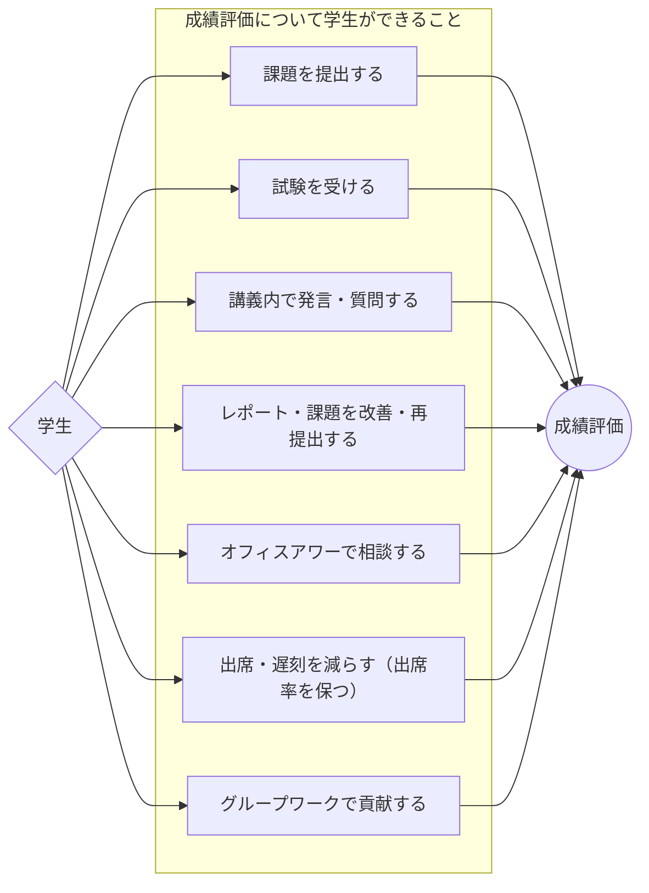

```mermaid
flowchart LR
  s{学生}
  t1[課題を提出する]
  t2[試験を受ける]
  t3[講義内で発言・質問する]
  t4[レポート・課題を改善・再提出する]
  t5[オフィスアワーで相談する]
  t6[出席・遅刻を減らす（出席率を保つ）]
  t7[グループワークで貢献する]
  k((成績評価))

  %% 学生 → 各行動
  s --> t1
  s --> t2
  s --> t3
  s --> t4
  s --> t5
  s --> t6
  s --> t7

  %% 各行動 → 成績評価
  t1 --> k
  t2 --> k
  t3 --> k
  t4 --> k
  t5 --> k
  t6 --> k
  t7 --> k
  
  subgraph "成績評価について学生ができること"
    t1
    t2
    t3
    t4
    t5
    t6
    t7
  end
```
