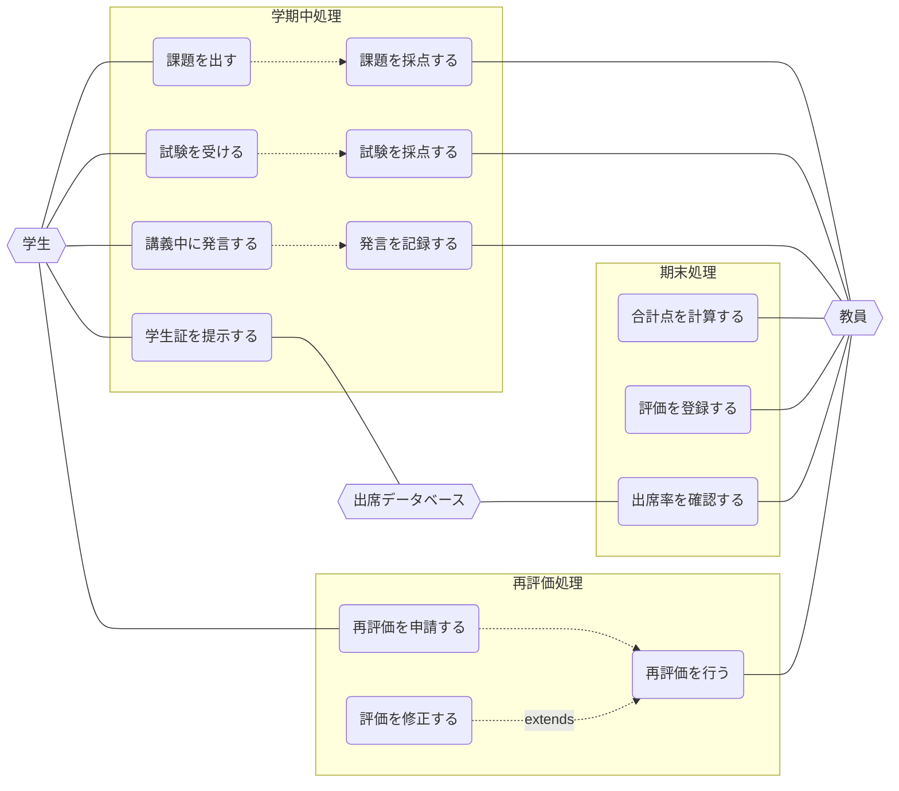

```mermaid
flowchart LR
%% アクター
st{{学生}}
sys{{教員}}
db{{出席データベース}}
%% 学期中処理
st --- t1(課題を出す)
st --- t2(試験を受ける)
st --- t3(講義中に発言する)
st --- at(学生証を提示する) --- db --- eva
st --- c1(再評価を申請する)
    t1 -.-> ev1(課題を採点する)
    t2 -.-> ev2(試験を採点する)
    t3 -.-> ev3(発言を記録する)
    c1 -.-> ev6(再評価を行う)
ev1 --- sys
ev2 --- sys
ev3 --- sys
    ev4(合計点を計算する) --- sys
    ev5(評価を登録する) --- sys
    eva(出席率を確認する) --- sys
ex1(評価を修正する)
%% ev6 ~~~ ex1
ex1 -. extends .-> ev6
ev6 --- sys
%% 区分
subgraph 学期中処理
t1
t2
t3
ev1
ev2
ev3
at
end
    subgraph 期末処理
    eva
    ev4
    ev5
    end
subgraph 再評価処理
direction TB
c1
ev6
ex1
end
```