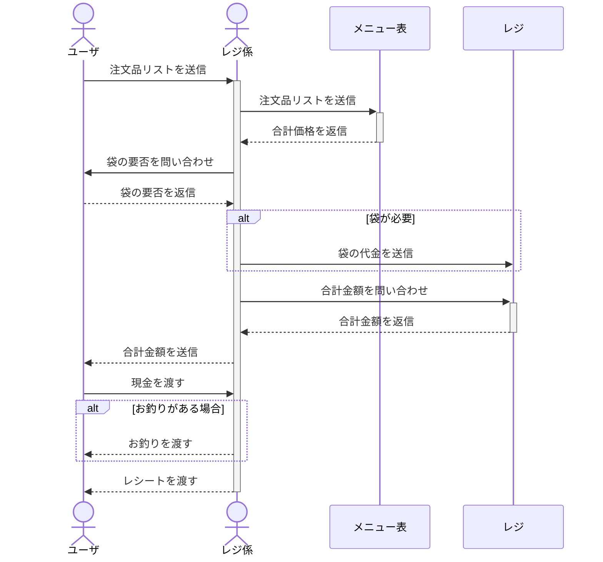

```mermaid
sequenceDiagram
%% 登場人物 : ユーザ、レジ係、メニュー表、レジ
actor u as ユーザ
actor c as レジ係
participant m as メニュー表
participant r as レジ

u ->>+ c : 注文品リストを送信
c ->>+ m : 注文品リストを送信
m -->>- c: 合計価格を返信
c ->> u  : 袋の要否を問い合わせ
u -->> c : 袋の要否を返信
alt 袋が必要
    c ->> r : 袋の代金を送信
end
c ->>+ r : 合計金額を問い合わせ
r -->>- c : 合計金額を返信
c -->> u : 合計金額を送信
u ->> c : 現金を渡す
alt お釣りがある場合
    c -->> u : お釣りを渡す
end
c -->>- u : レシートを渡す
```