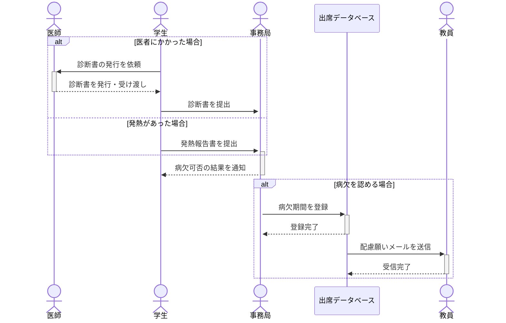

```mermaid
sequenceDiagram
%% 病欠届提出シーケンス
actor d as 医師
actor s as 学生
actor o as 事務局
participant db as 出席データベース
actor t as 教員
%%
alt 医者にかかった場合
    s ->>+ d : 診断書の発行を依頼
    d -->>- s : 診断書を発行・受け渡し
    s ->>+ o : 診断書を提出
else 発熱があった場合
    s ->>+ o : 発熱報告書を提出
end
%% o ->> o : 病欠可否を判断
o -->>- s : 病欠可否の結果を通知
alt 病欠を認める場合
    o ->>+ db : 病欠期間を登録
    db -->>- o : 登録完了
    db ->>+ t : 配慮願いメールを送信
    t -->>- db : 受信完了
%% else 病欠を認めない場合
    %% o ->> o : 登録処理を行わない
end
```