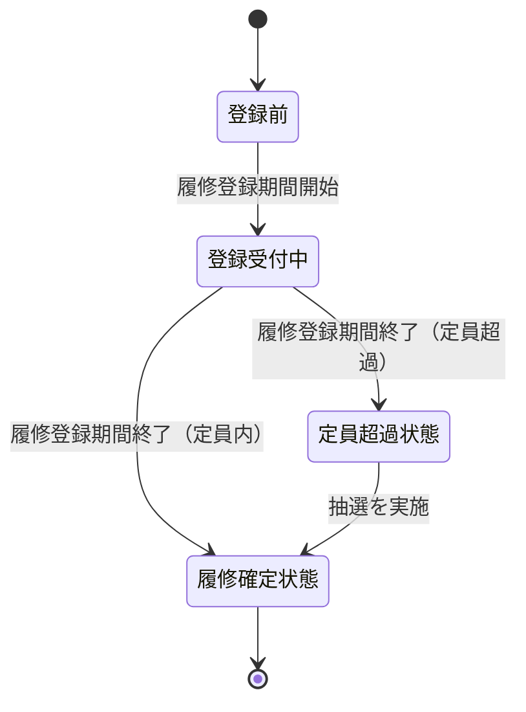

```mermaid
stateDiagram-v2

  s1 : 登録前
  s2 : 登録受付中
  s3 : 定員超過状態
  s4 : 履修確定状態

  [*] --> s1
  s1 --> s2 : 履修登録期間開始
  s2 --> s3 : 履修登録期間終了（定員超過）
  s2 --> s4 : 履修登録期間終了（定員内）
  s3 --> s4 : 抽選を実施
  s4 --> [*]
```
