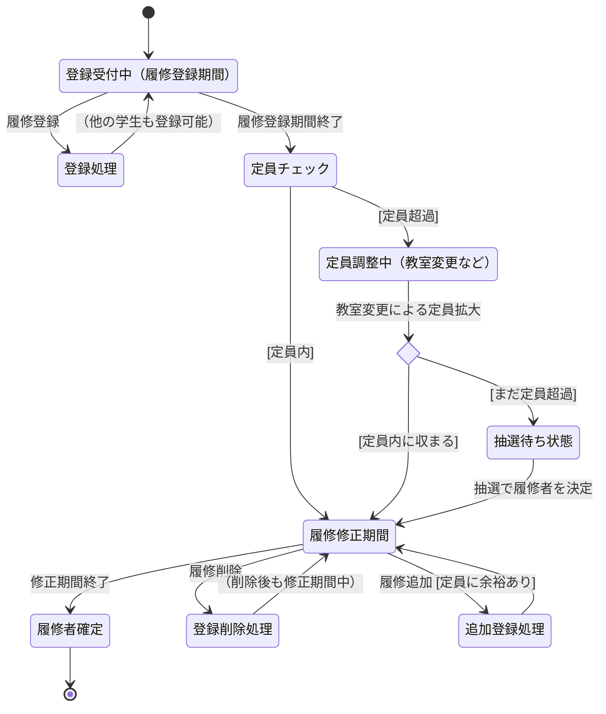

```mermaid
stateDiagram-v2
direction TB
s1 : 登録受付中（履修登録期間）
r1 : 登録処理
sc : 定員チェック
s2 : 定員調整中（教室変更など）
s3 : 抽選待ち状態
ss : 履修修正期間
se : 履修者確定
rd : 登録削除処理
ra : 追加登録処理

state ch <<choice>>
[*] --> s1
s1 --> r1 : 履修登録
r1 --> s1 : （他の学生も登録可能）

s1 --> sc : 履修登録期間終了
%% a
%% 定員チェック後の分岐
sc --> s2 : [定員超過]
sc --> ss : [定員内]

%% 教室変更による調整
s2 --> ch : 教室変更による定員拡大
ch --> s3 : [まだ定員超過]
ch --> ss : [定員内に収まる]

%% 抽選処理
s3 --> ss : 抽選で履修者を決定

%% 修正期間内の操作
ss --> rd : 履修削除
rd --> ss : （削除後も修正期間中）

ss --> ra : 履修追加 [定員に余裕あり]
ra --> ss

ss --> se : 修正期間終了

se --> [*]

```