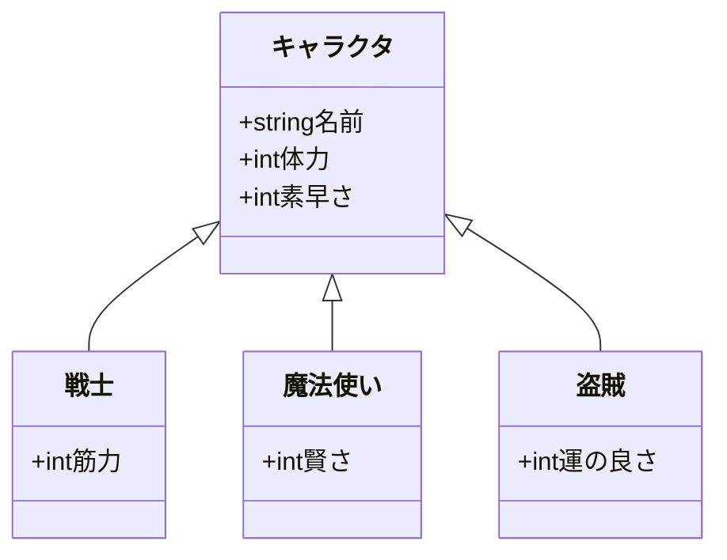

```mermaid
classDiagram
   class キャラクタ
   キャラクタ : +string名前
   キャラクタ : +int体力
   キャラクタ : +int素早さ
   class 戦士{
   +int筋力
   }
   class 魔法使い
   魔法使い : +int賢さ
   class 盗賊
   盗賊 : +int運の良さ

   キャラクタ <|-- 戦士
   キャラクタ <|-- 魔法使い
   キャラクタ <|-- 盗賊
```