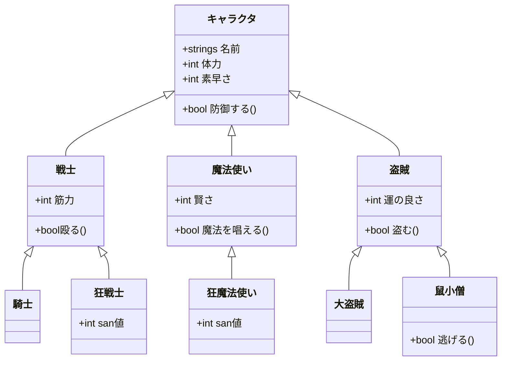

```mermaid
classDiagram
   class キャラクタ{
   +strings 名前
   +int 体力
   +int 素早さ
   +bool 防御する()
   }
   class 戦士
   戦士 : +int 筋力
   戦士 : +bool殴る()
   class 魔法使い{
   +int 賢さ
   +bool 魔法を唱える()
   }

   class 盗賊
   盗賊 : +int 運の良さ
   盗賊 : +bool 盗む()
   class 騎士
   class 狂戦士
   狂戦士 : +int san値
   class 狂魔法使い
   狂魔法使い : +int san値
   class 大盗賊
   class 鼠小僧
   鼠小僧 : +bool 逃げる()

   キャラクタ <|-- 戦士
   キャラクタ <|-- 魔法使い
   キャラクタ <|-- 盗賊
   戦士 <|-- 騎士
   戦士 <|-- 狂戦士
   魔法使い <|-- 狂魔法使い
   盗賊 <|-- 大盗賊
   盗賊 <|-- 鼠小僧
```